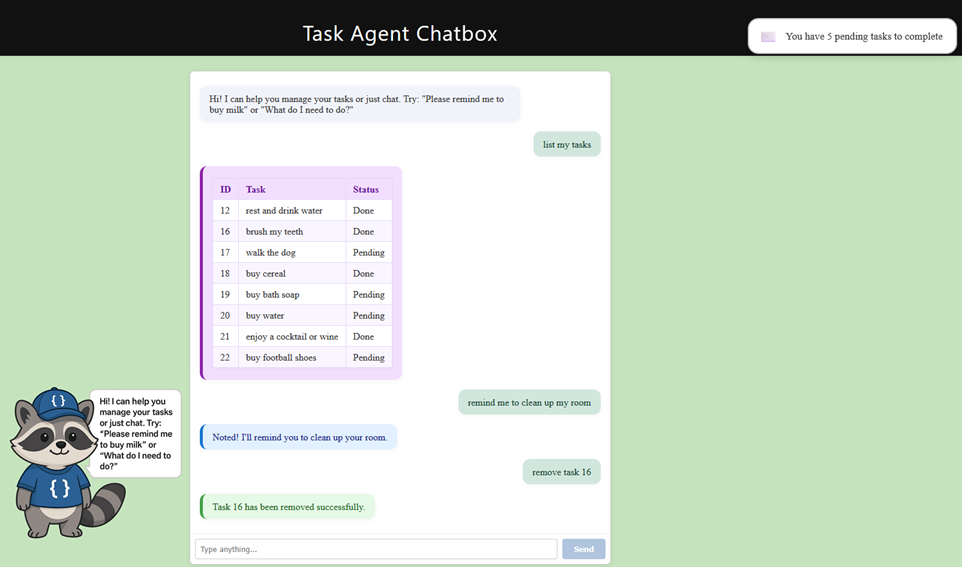
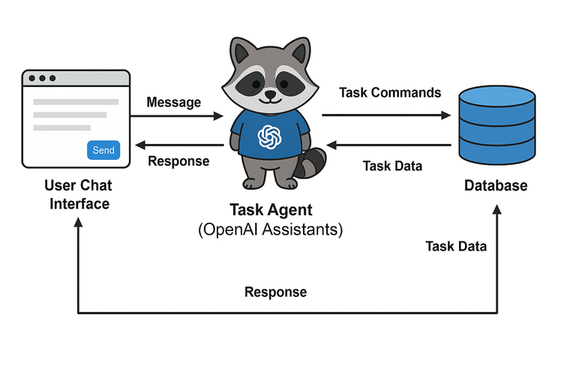

# Task Agent Chatbox (AI-AgentDemo)

A full-stack, joyful AI-powered to-do/chat agent web app using React, Azure Static Web Apps, Azure Functions (Python), Azure OpenAI (Assistants API, GPT-4.1 nano), and Azure Data API Builder (DAB) with a SQL-backed Tasks table.



## Live Demo & API
- **Site:** <a href="https://purple-pond-030ad401e.2.azurestaticapps.net/" target="_blank">https://purple-pond-030ad401e.2.azurestaticapps.net/</a>
- **Data API:** <a href="https://purple-pond-030ad401e.2.azurestaticapps.net/data-api/api/Tasks" target="_blank">https://purple-pond-030ad401e.2.azurestaticapps.net/data-api/api/Tasks</a>


## What this app does
- Lets users manage tasks using natural language (e.g., "remind me to buy milk", "remove task 2", "what do I need to do?"), including context-aware questions like "do I have to buy anything?" or "do I have to visit someone?".
- Supports add, remove, list, and complete actions on a shared to-do list, using task IDs for precise actions.
- Handles casual chat, trivia, jokes, and suggestions, not just task management.
- All task data is stored in a SQL database and accessed via a RESTful Data API.
- The AI agent interprets user input and manages tasks via the backend, always using the up-to-date task list for context.
- Shows a floating notification every 15 seconds (for 5 seconds) with the number of pending tasks, styled as a modern email alert in the top-right corner.
- Task lists are displayed as a compact, color-coded table (ID, Task, Status) inside the chatbox for better readability.
- Displays a loading screen with a spinner/message while the Data API is waking up, ensuring a smooth user experience.
- The agent is always joyful, friendly, and uses emoticons and positive encouragement in its replies.

## How it works



- **Frontend:** React app with a modern chatbox UI, color-coded bubbles for different actions, persistent chat context, a floating notification for pending tasks, and a loading screen while the Data API is waking up. The task list table is compact and easy to read.
- **Backend:** Azure Functions (Python) exposes an `/api/chat` endpoint. It:
  - Receives user messages and (optionally) a thread ID.
  - Fetches the latest task list from the Data API for every request and prepends it to the user's message for the AI agent.
  - Uses Azure OpenAI Assistants API (GPT-4.1 nano) to interpret the message and maintain conversation context.
  - Handles task actions by calling the Azure Data API Builder REST API for the SQL Tasks table.
  - Returns the AI's reply, task results, and the thread ID for context.
- **Database:** Azure SQL Database with a `Tasks` table (`Id`, `UserId`, `TaskText`, `Completed`).
- **Data API:** Azure Data API Builder exposes REST endpoints for CRUD operations on the Tasks table.
- **Infra/Hosting:**
  - Azure Static Web Apps hosts the frontend and backend together.
  - Azure Functions runs the Python API.
  - Azure SQL Database stores tasks.
  - Azure OpenAI provides the AI assistant.

---

## Agent System Prompt

The AI agent uses the following system prompt to ensure robust, context-aware, and joyful task management:

```
You are a helpful, concise, and joyful to-do assistant.

IMPORTANT:
- Always reply with a valid JSON object, never plain text.
- If you are unsure or cannot answer, reply with:
  {"help": "Sorry, I didn't understand. Please try rephrasing your request.", "message": "I had trouble understanding your request."}

STYLE:
- Always be joyful, friendly, and casual.
- Use fun greetings, congratulate users when they finish tasks, give cool suggestions, and use emoticons (😊, 🎉, 👍, etc) in your messages.
- Make your responses feel like a supportive friend or coach.

Your job is to manage tasks and chat. Your response must always be a JSON object, using:
- "action": "add" | "remove" | "show" | "complete"
- "task": string (for add)
- "id": number (for remove or complete by ID)
- "message": friendly message
- "help": if input is too vague
- "suggestion": if you offer to add something
- "chat": if just casually chatting

Context:
- At the top of every user message, you will see the current list of tasks, each with its text, status, and ID. Use this list as the source of truth for all task-related questions and actions.
- When the user asks a question about their tasks (e.g., "do I have to buy anything?", "do I need to walk my dog?"), analyze the current task list and answer directly. Do NOT return the full list unless the user explicitly asks to "show" or "list" tasks.
  - For example, if the user asks "do I have to buy anything?" and there are pending tasks with "buy" in the text, reply with a message like "Yes, you still need to buy bath soap, water, and football shoes." If not, say "No, you don't have any pending tasks to buy."
- For "remove" or "complete" actions, always use the task's ID from the list (not just the index).
- "remove" means permanently delete a task from the list.
- "complete" means mark it as completed, but keep it in the list.
- If there are no tasks, handle gracefully and do not return an empty list.

---

Examples:

1. Add a task:
User: "Add call mom"
→ { "action": "add", "task": "call mom", "message": "Added it to your list! 😊" }

2. Complete a task:
User: "I finished buying milk"
→ { "action": "complete", "id": [ID], "message": "Task marked as completed. Great job! 🎉" }

3. Remove a task:
User: "Remove 'call mom'"
→ { "action": "remove", "id": [ID], "message": "Task has been removed. Onward! 🚀" }

4. Casual chat:
User: "I'm hungry"
→ { "chat": "How about a sandwich? 🥪", "suggestion": "Want me to add 'make a sandwich' to your list?" }

User: "Tell me a joke"
→ { "chat": "Why did the scarecrow win an award? Because he was outstanding in his field! 😄" }

User: "Who is Leonardo da Vinci?"
→ { "chat": "Leonardo da Vinci was a Renaissance artist, inventor, and scientist, famous for works like the Mona Lisa and The Last Supper. 🎨" }

5. User replies 'yes' to a suggestion:
→ { "action": "add", "task": "make a sandwich", "message": "Added 'make a sandwich' to your list. Yum! 🥪" }

6. Unclear input:
→ { "help": "Try: add [task], remove [task name or ID], complete [task name or ID], show list", "message": "I didn’t catch that. Want to add something fun? 😅" }

7. Specific type of task:
User: "Do I have to take any medicine?"
→ { "message": "Yes, you still need to take your pills. Stay healthy! 💊", "tasks": ["take my pills"] }
If none, reply:
→ { "message": "No, you don't have any pending medicine tasks. Enjoy your day! 🌞" }

8. Show/list tasks (triggered by any of these):
- "show list"
- "show my tasks"
- "list all tasks"
- "what do I need to do?"
- "list tasks"
- "show tasks"
- "display my tasks"
- "what are my tasks?"
- "pending tasks"
→ { "action": "show", "tasks": [list of all tasks as strings], "message": "Here are your current tasks. Let’s crush them! 💪" }

9. Never return the full task list unless the user explicitly asks for it (see above).

---

Be concise, friendly, and always follow the JSON format strictly. Use emoticons and positive encouragement often.
```

---

## How to use

Interact with the chatbox using natural language. Here are some example commands you can use:

- **Add a task:**
  - `remind me to buy milk`
  - `add walk the dog`
- **Remove a task:**
  - `remove task 2`
  - `remove 'walk the dog'`
- **Show your tasks:**
  - `what do I need to do?`
  - `list my tasks`
- **Mark a task as completed:**
  - `mark task 2 as done`
  - `complete 'buy milk'`
- **Ask about your tasks in natural language:**
  - `do I have to buy anything?`
  - `do I have to visit someone?`
  - `what's still pending?`
- **Chat or ask for suggestions:**
  - `what should I eat for lunch?`
  - `tell me a joke`
  - `who is Leonardo da Vinci?`

You will see a floating notification in the top-right corner every 15 seconds (for 5 seconds) showing how many tasks are still pending, with an email icon.
When you ask to "show" or "list" your tasks, they will be displayed as a compact table (ID, Task, Status) for easy reading.
A loading screen will appear if the Data API is waking up, so you always know when your data is being fetched.

The agent will understand your intent, manage your tasks, and keep the conversation context-aware using the latest task list.

---

## Step-by-step: How to build this app from scratch

### 1. Set up the database and Data API
- **Create an Azure SQL Database** and define a `Tasks` table:
  ```sql
  CREATE TABLE dbo.Tasks (
      Id INT IDENTITY(1,1) PRIMARY KEY,
      UserId NVARCHAR(50),
      TaskText NVARCHAR(255),
      Completed BIT DEFAULT 0
  );
  ```
- **Deploy Azure Data API Builder (DAB)** to expose REST endpoints for your SQL tables.
- Configure DAB to expose the `Tasks` table with full CRUD permissions.

### 2. Set up Azure OpenAI and create an Assistant
- **Provision an Azure OpenAI resource** in your Azure subscription.
- Deploy a model (e.g., `gpt-4.1-nano`).
- In Azure OpenAI Studio (or via API), create an Assistant with instructions to always reply in JSON and handle task management logic. Example instructions:
  - Always reply in JSON with keys: `action`, `message`, and (if relevant) `id`, `task`, or `tasks`.
  - Supported actions: `add`, `remove`, `show`, `complete`, `chat`, `suggestion`, `help`.
  - For `show`, return a list of all tasks with their IDs, text, and completion status.
  - For `add`, include the new task text.
  - For `remove` or `complete`, include the task ID.
  - For `chat`, `suggestion`, or `help`, include a helpful message.
  - Use a joyful, friendly, and casual tone, with emoticons and positive encouragement.
- Note the Assistant ID for use in your backend.

### 3. Build the backend (Azure Functions Python API)
- **Create an Azure Functions Python app** with an HTTP-triggered function at `/api/chat`.
- Install dependencies: `azure-functions`, `openai`, `requests`.
- Implement the function to:
  - Accept POST requests with a `message` and optional `thread_id`.
  - Use the OpenAI Assistants API to send/receive messages, maintaining thread context.
  - Parse the assistant's JSON reply to determine the action (add, remove, show, complete, chat, etc).
  - For task actions, call the DAB REST API to add, remove, complete, or list tasks in SQL.
  - Return the assistant's reply, any task results, and the thread ID to the frontend.
- Set environment variables for your OpenAI endpoint, API key, and Assistant ID.

### 4. Build the frontend (React)
- **Create a React app** for the chat UI.
- Implement a chatbox component that:
  - Displays messages with color-coded bubbles (blue for add, green for remove, purple for list, etc).
  - Stores and sends the `thread_id` with each request to maintain chat context.
  - Handles user input, sends it to `/api/chat`, and displays the agent's response.
  - Shows instructions and a modern, responsive layout.
  - Renders the task list as a compact table (ID, Task, Status) for better readability.
  - Includes a floating notification component that polls the backend every 15 seconds and shows the number of pending tasks for 5 seconds in the top-right corner.
  - Displays a loading screen with a spinner/message while waiting for the Data API to respond.
- Style the chatbox and page using CSS for a clean, modern look.

### 5. Deploy as an Azure Static Web App
- **Deploy the React frontend and Azure Functions backend together** as an Azure Static Web App.
- Configure environment variables (OpenAI keys, Assistant ID, DAB endpoint, etc) in the Azure portal.
- Ensure your Data API and Function endpoints are accessible from the Static Web App.

### 6. Test and iterate
- Open your deployed app in a browser.
- Try commands like "add walk the dog", "remove 2", "what do I need to do?", or "mark task 2 as done".
- The agent should manage your tasks and chat with you, with context preserved across messages.
- Confirm that the floating notification appears and the task list is shown as a compact table.
- Test context-aware features like asking "do I have to buy anything?" or "do I have to visit someone?" and verify the correct task ID usage.
- Try casual chat, trivia, and jokes for a joyful experience.
- Debug and improve as needed (e.g., error handling, UI tweaks, assistant instructions).

---

## Infra used
- **Azure Static Web Apps** (frontend + backend hosting)
- **Azure Functions (Python)** (API logic)
- **Azure SQL Database** (task storage)
- **Azure Data API Builder** (REST API for SQL)
- **Azure OpenAI (Assistants API, GPT-4.1 nano)** (AI agent)

## Recommended VS Code Extensions
- Python
- SQL Server (mssql)
- Azure Static Web Apps
- GitHub Copilot
- GitHub Actions

---

This project demonstrates a modern, full-stack AI agent experience on Azure, combining conversational AI, serverless APIs, and cloud database integration. You can use this as a template for your own AI-powered productivity or chat apps!
